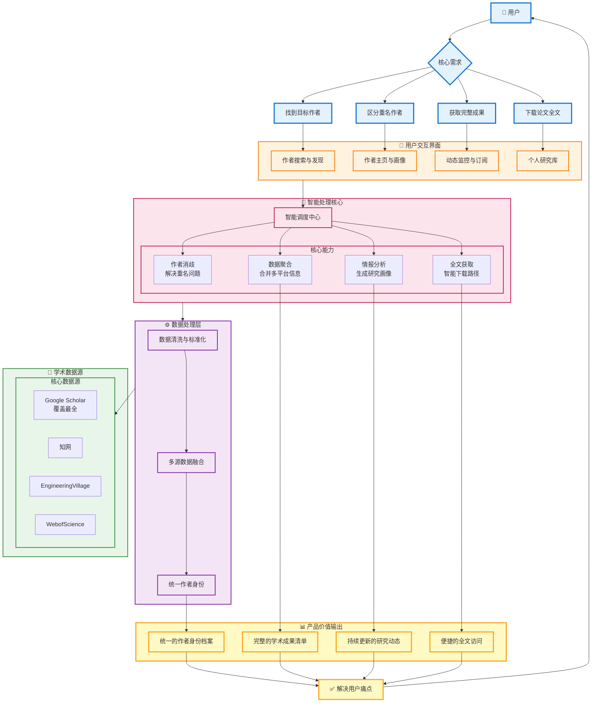

该文档侧重于**“以作者为中心”**的独特逻辑和**“Agent 驱动”**的技术架构。

------

# 产品设计方案：作者级学术情报 Agent 平台

Project Code: Academic Author Intelligence Platform (AAIP)

Version: 1.0 (MVP Draft)

------

## 1. 产品概述 (Executive Summary)

### 1.1 产品定位

面向科研、投研与情报分析场景的 “作者级学术情报 Agent 平台”。

它不是另一个论文搜索引擎，而是学术界的“天眼查”或“企查查”——解决作者难找、重名难分、成果难全、下载难统一的行业顽疾。

### 1.2 核心愿景

- **从“搜文”转向“搜人”**：建立全网唯一的作者身份 ID (Universal Author ID)。
- **从“检索”转向“情报”**：利用 Agent 自动生成画像、监控动态、分析影响力。

### 1.3 核心价值主张 (Value Proposition)

| **维度**     | **传统工具 (Google Scholar/WoS)** | **本平台 (AAIP)**               |
| ------------ | --------------------------------- | ------------------------------- |
| **颗粒度**   | 论文 (Paper-centric)              | **作者 (Author-centric)**       |
| **数据源**   | 单一/封闭                         | **多源聚合 (Scholar+CNKI+WoS)** |
| **重名处理** | 弱/无 (主要靠人工认领)            | **强消歧 Agent (多因子加权)**   |
| **交付形态** | 列表搜索                          | **智能对话 & 动态情报**         |

------

## 2. 用户与场景定义 (User Stories)

| **用户画像**        | **核心痛点**                 | **典型场景 (User Story)**                                    |
| ------------------- | ---------------------------- | ------------------------------------------------------------ |
| **科研人员/博士生** | 文献调研效率低，导师背景难查 | "我想在一个页面看完这位教授所有中英文论文，并快速知道他的研究路线演变。" |
| **VC/PE 投资人**    | 技术尽调难，寻找“水下”专家   | "我想找深耕 LLM 且还没创业的大牛，分析他在工业界的引用率，判断技术落地能力。" |
| **企业 HR/猎头**    | 难以评估候选人真实技术栈     | "收到一份简历，需快速核实其论文真实性，并排除重名干扰，生成一份技术能力评估报告。" |
| **政府/园区**       | 人才引进缺乏数据支撑         | "需要一份某领域全球华人青年学者的名单及影响力分析报告。"     |

------

## 3. 总体架构设计 (System Architecture)

系统遵循 **“Agent 负责推理，系统负责执行”** 的原则，采用分层架构。

代码段

------

## 4. 核心功能详解 (Core Features)

### 4.1 智能搜索与实体消歧 (Search & Disambiguation) —— **核心护城河**

- **输入：** `Wei Wang` + `Tsinghua` + `LLM` (支持模糊查询)
- **处理流程 (Agent Workflow)：**
  1. **候选召回：** 从各数据源召回所有可能的 "Wei Wang"。
  2. **特征提取：** 提取 Email、单位、合作者、关键词、发表年份。
  3. **聚类评分 (Clustering)：** 计算相似度矩阵。
     - *强特征：* Email 匹配 (权重 1.0)
     - *中特征：* 合作者重叠 (权重 0.8)、机构连续性 (权重 0.7)
     - *弱特征：* 摘要语义相似度 (权重 0.5)
  4. **人工/AI 验证：** 对置信度 < 0.8 的结果，生成“消歧卡片”让用户辅助确认。
- **输出：** 唯一的 `Author_Profile_ID`，聚合后的论文列表。

### 4.2 360° 学术画像 (Academic Profiling)

- **基础档案：** 姓名、当前机构、历史履历时间轴、H-index (综合/近五年)。
- **学术指纹 (Research Fingerprint)：**
  - 利用 NLP 提取关键词云，展示**研究兴趣迁移图** (例如：2018 CV -> 2023 AIGC)。
- **关系图谱：** 可视化展示**核心圈子** (常驻合作者) 与**师承关系**。
- **成果列表：**
  - **自动去重：** 合并 Pre-print (arXiv) 和正式发表 (IEEE/Nature) 的同一篇论文。
  - **合规下载：** 仅提供 OA 链接、Publisher 官方链接，或跳转机构库。

### 4.3 Agent 智能情报 (AI Interaction)

- **Chat with Author (虚拟数字人)：**
  - 用户可针对该作者的所有论文进行提问。
  - *Prompt 示例：* "根据王教授 2024 年的论文，总结他对 RAG 系统的最新改进思路。"
- **主动监控 (Active Monitoring)：**
  - 关注作者后，系统自动推送：新发论文提醒、机构变动提醒、新的合作关系提醒。

------

## 5. 数据源与合规策略 (Data Strategy)

采用 **“全球索引 + 垂直权威 + 本土阵地”** 的混合策略。

| **优先级** | **数据源**              | **定位**     | **技术/合规策略**                               |
| ---------- | ----------------------- | ------------ | ----------------------------------------------- |
| **P0**     | **Google Scholar**      | 全球兜底索引 | 动态轻量抓取 (On-demand) + 缓存，不做全量镜像。 |
| **P0**     | **Engineering Village** | 工程技术权威 | 对接商业 API (B 端付费支撑)。                   |
| **P1**     | **Web of Science**      | 引用与影响力 | 对接商业 API，获取高质量引文数据。              |
| **P1**     | **CNKI (中国知网)**     | 中文主阵地   | 专门适配中文作者名，解决中英文同人识别问题。    |

**⚠️ PDF 合规红线：**

- 严禁直接存储版权保护期的 PDF。
- 严禁破解付费墙。
- 所有下载行为均表现为“跳转”或“代理访问 OA 资源”。

------

## 6. 商业模式 (Business Model)

| **模式**             | **目标客户**     | **定价策略** | **权益**                                           |
| -------------------- | ---------------- | ------------ | -------------------------------------------------- |
| **Freemium (C端)**   | 学生/普通研究员  | 免费         | 基础搜索、查看画像、每日 5 次 AI 对话。            |
| **Pro (C端)**        | 高级研究员/教授  | 月付订阅     | 无限 AI 对话、跨库高级消歧、新论文实时推送。       |
| **Enterprise (B端)** | 猎头/VC/企业研发 | 年付/席位    | **批量人才画像导出**、技术尽调报告生成、API 对接。 |
| **Deployment (G端)** | 园区/高校        | 项目制       | 私有化部署人才库系统。                             |

------

## 7. MVP 实施路线图 (Roadmap)

**阶段一：核心验证 (Weeks 1-8)**

- **目标：** 完成“搜人”流程，解决中英文混淆。
- **功能：**
  - 接入 Google Scholar。
  - 实现基于规则 + 简单 NLP 的消歧算法。
  - 生成基础作者主页 (Timeline + Paper List)。

**阶段二：Agent 增强 (Weeks 9-12)**

- **目标：** 提升粘性，体现 AI 价值。
- **功能：**
  - 上线 "Chat with Author" (RAG)。
  - 上线“学术指纹”可视化。

**阶段三：商业化与扩展 (Weeks 13+)**

- **目标：** 拓展 B 端数据源。
- **功能：**
  - 接入 WoS/EV API。
  - 推出企业版 Dashboard。

------

### 8. 总结

本项目本质上是 **构建学术界的“Entity Graph”（实体图谱）**。通过 Agent 技术降低了构建这个图谱的边际成本，并通过 B 端的高价值场景（猎头、投研）实现商业变现，最终反哺 C 端科研用户。